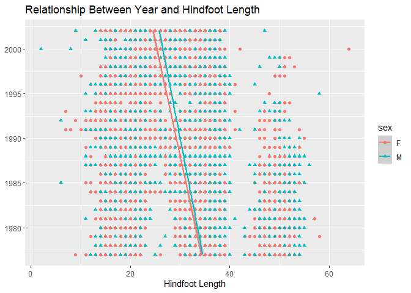

## Instructions
Answer the following questions and complete the exercises in RMarkdown. Please embed all of your code and push your final work to your repository. Your final lab report should be organized, clean, and run free from errors. Remember, you must remove the `#` for the included code chunks to run. Be sure to add your name to the author header above. For any included plots, make sure they are clearly labeled. You are free to use any plot type that you feel best communicates the results of your analysis.  

Make sure to use the formatting conventions of RMarkdown to make your report neat and clean!  

## Load the libraries

```r
library(tidyverse)
library(janitor)
library(here)
library(naniar)
```


```r
options(scipens=999)
```

## Desert Ecology
For this assignment, we are going to use a modified data set on [desert ecology](http://esapubs.org/archive/ecol/E090/118/). The data are from: S. K. Morgan Ernest, Thomas J. Valone, and James H. Brown. 2009. Long-term monitoring and experimental manipulation of a Chihuahuan Desert ecosystem near Portal, Arizona, USA. Ecology 90:1708.

```r
deserts <- read_csv(here("lab10", "data", "surveys_complete.csv"))
```

```
## 
## -- Column specification --------------------------------------------------------
## cols(
##   record_id = col_double(),
##   month = col_double(),
##   day = col_double(),
##   year = col_double(),
##   plot_id = col_double(),
##   species_id = col_character(),
##   sex = col_character(),
##   hindfoot_length = col_double(),
##   weight = col_double(),
##   genus = col_character(),
##   species = col_character(),
##   taxa = col_character(),
##   plot_type = col_character()
## )
```

1. Use the function(s) of your choice to get an idea of its structure, including how NA's are treated. Are the data tidy?  

The data is tidy. The NA's appear to be marked as NA's so we don't have to modify the data in any way. 

```r
summary(deserts)
```

```
##    record_id         month             day            year         plot_id     
##  Min.   :    1   Min.   : 1.000   Min.   : 1.0   Min.   :1977   Min.   : 1.00  
##  1st Qu.: 8964   1st Qu.: 4.000   1st Qu.: 9.0   1st Qu.:1984   1st Qu.: 5.00  
##  Median :17762   Median : 6.000   Median :16.0   Median :1990   Median :11.00  
##  Mean   :17804   Mean   : 6.474   Mean   :16.1   Mean   :1990   Mean   :11.34  
##  3rd Qu.:26655   3rd Qu.:10.000   3rd Qu.:23.0   3rd Qu.:1997   3rd Qu.:17.00  
##  Max.   :35548   Max.   :12.000   Max.   :31.0   Max.   :2002   Max.   :24.00  
##                                                                                
##   species_id            sex            hindfoot_length     weight      
##  Length:34786       Length:34786       Min.   : 2.00   Min.   :  4.00  
##  Class :character   Class :character   1st Qu.:21.00   1st Qu.: 20.00  
##  Mode  :character   Mode  :character   Median :32.00   Median : 37.00  
##                                        Mean   :29.29   Mean   : 42.67  
##                                        3rd Qu.:36.00   3rd Qu.: 48.00  
##                                        Max.   :70.00   Max.   :280.00  
##                                        NA's   :3348    NA's   :2503    
##     genus             species              taxa            plot_type        
##  Length:34786       Length:34786       Length:34786       Length:34786      
##  Class :character   Class :character   Class :character   Class :character  
##  Mode  :character   Mode  :character   Mode  :character   Mode  :character  
##                                                                             
##                                                                             
##                                                                             
## 
```

2. How many genera and species are represented in the data? What are the total number of observations? Which species is most/ least frequently sampled in the study?


```r
deserts %>% 
  tabyl(genus) %>%
  arrange(desc(n)) %>% 
  adorn_totals() 
```

```
##             genus     n      percent
##         Dipodomys 16167 4.647559e-01
##       Chaetodipus  6029 1.733169e-01
##         Onychomys  3267 9.391709e-02
##   Reithrodontomys  2694 7.744495e-02
##        Peromyscus  2234 6.422124e-02
##       Perognathus  1629 4.682918e-02
##           Neotoma  1252 3.599149e-02
##  Ammospermophilus   437 1.256253e-02
##        Amphispiza   303 8.710401e-03
##      Spermophilus   249 7.158052e-03
##          Sigmodon   233 6.698097e-03
##        Sylvilagus    75 2.156040e-03
##            Pipilo    52 1.494854e-03
##   Campylorhynchus    50 1.437360e-03
##           Baiomys    46 1.322371e-03
##        Callipepla    16 4.599552e-04
##       Calamospiza    13 3.737136e-04
##            Rodent    10 2.874720e-04
##         Pooecetes     8 2.299776e-04
##        Sceloporus     6 1.724832e-04
##            Lizard     4 1.149888e-04
##           Sparrow     4 1.149888e-04
##        Ammodramus     2 5.749439e-05
##     Cnemidophorus     2 5.749439e-05
##          Crotalus     2 5.749439e-05
##       Zonotrichia     2 5.749439e-05
##             Total 34786 1.000000e+00
```


```r
deserts %>% 
  summarise(distinct_genus=n_distinct(genus))
```

```
## # A tibble: 1 x 1
##   distinct_genus
##            <int>
## 1             26
```

```r
deserts %>% 
  tabyl(species) %>%
  arrange(desc(n)) %>% 
  adorn_totals()
```

```
##          species     n      percent
##         merriami 10596 3.046053e-01
##     penicillatus  3123 8.977750e-02
##            ordii  3027 8.701777e-02
##          baileyi  2891 8.310815e-02
##        megalotis  2609 7.500144e-02
##      spectabilis  2504 7.198298e-02
##         torridus  2249 6.465245e-02
##           flavus  1597 4.590927e-02
##         eremicus  1299 3.734261e-02
##         albigula  1252 3.599149e-02
##      leucogaster  1006 2.891968e-02
##      maniculatus   899 2.584373e-02
##          harrisi   437 1.256253e-02
##        bilineata   303 8.710401e-03
##        spilosoma   248 7.129305e-03
##         hispidus   179 5.145748e-03
##              sp.    86 2.472259e-03
##        audubonii    75 2.156040e-03
##       fulvescens    75 2.156040e-03
##  brunneicapillus    50 1.437360e-03
##          taylori    46 1.322371e-03
##      fulviventer    43 1.236129e-03
##     ochrognathus    43 1.236129e-03
##        chlorurus    39 1.121141e-03
##         leucopus    36 1.034899e-03
##         squamata    16 4.599552e-04
##      melanocorys    13 3.737136e-04
##      intermedius     9 2.587248e-04
##        gramineus     8 2.299776e-04
##         montanus     8 2.299776e-04
##           fuscus     5 1.437360e-04
##        undulatus     5 1.437360e-04
##       leucophrys     2 5.749439e-05
##       savannarum     2 5.749439e-05
##           clarki     1 2.874720e-05
##       scutalatus     1 2.874720e-05
##     tereticaudus     1 2.874720e-05
##           tigris     1 2.874720e-05
##        uniparens     1 2.874720e-05
##          viridis     1 2.874720e-05
##            Total 34786 1.000000e+00
```


```r
deserts %>% 
  summarise(distinct_species=n_distinct(species))
```

```
## # A tibble: 1 x 1
##   distinct_species
##              <int>
## 1               40
```

3. What is the proportion of taxa included in this study? Show a table and plot that reflects this count.

```r
deserts %>% 
  count(taxa, sort=T)
```

```
## # A tibble: 4 x 2
##   taxa        n
##   <chr>   <int>
## 1 Rodent  34247
## 2 Bird      450
## 3 Rabbit     75
## 4 Reptile    14
```


```r
taxa_observations <- deserts %>% 
  ggplot(aes(x=taxa))+
  geom_bar()+
  labs(title = "Observations of Taxa")+
  theme(plot.title = element_text(size = rel(1), hjust = 0.5))

taxa_observations
```

<!-- -->

4. For the taxa included in the study, use the fill option to show the proportion of individuals sampled by `plot_type.`

```r
taxa_observations <- deserts %>% 
  ggplot(aes(x=taxa, fill=plot_type))+
  geom_bar(position = "dodge")+
  labs(title = "Observations of Taxa")+
  theme(plot.title = element_text(size = rel(1), hjust = 0.5))

taxa_observations
```

<!-- -->

5. What is the range of weight for each species included in the study? Remove any observations of weight that are NA so they do not show up in the plot.

```r
deserts %>%
  filter(weight!="NA") %>% 
  ggplot(aes(x=species, y=weight))+
  geom_boxplot()+
  coord_flip()+
  labs(title="Range of Weight of Species")+
  theme(plot.title = element_text(size = rel(1), hjust = 0.5))
```

<!-- -->

6. Add another layer to your answer from #4 using `geom_point` to get an idea of how many measurements were taken for each species.


```r
deserts%>%
group_by(species)%>%
filter(weight!="NA")%>%
count(species)%>%
ggplot(aes(x=species,y=n))+
geom_point(size=2)+
coord_flip()+
labs(title = "Weight Measurements per Species",x="Species",y="Number of Measurements")
```

<!-- -->


7. [Dipodomys merriami](https://en.wikipedia.org/wiki/Merriam's_kangaroo_rat) is the most frequently sampled animal in the study. How have the number of observations of this species changed over the years included in the study?

```r
deserts %>% 
  group_by(year) %>% 
  filter(species=="merriami") %>% 
  ggplot(aes(x=year))+
  geom_bar()+
  labs(title="Observations of Merriami By Year",
       x=NULL,
       y="Number of Observations")
```

<!-- -->

8. What is the relationship between `weight` and `hindfoot` length? Consider whether or not over plotting is an issue.

```r
deserts %>% 
  filter(weight!="NA" & hindfoot_length!="NA") %>% 
  ggplot(aes(x=hindfoot_length, y=weight))+
  geom_point(size=1)+
  geom_smooth(method = lm)+
  labs(title="Relationship Between Weight and Hindfoot Length",
       x="Hindfoot Length",
       y="Weight(kg)")
```

```
## `geom_smooth()` using formula 'y ~ x'
```

<!-- -->

9. Which two species have, on average, the highest weight? Once you have identified them, make a new column that is a ratio of `weight` to `hindfoot_length`. Make a plot that shows the range of this new ratio and fill by sex.

```r
deserts %>% 
  group_by(species) %>%
  filter(weight!="NA") %>% 
  summarise(avg_weight=mean(weight)) %>% 
  arrange(desc(avg_weight))
```

```
## # A tibble: 22 x 2
##    species      avg_weight
##    <chr>             <dbl>
##  1 albigula          159. 
##  2 spectabilis       120. 
##  3 spilosoma          93.5
##  4 hispidus           65.6
##  5 fulviventer        58.9
##  6 ochrognathus       55.4
##  7 ordii              48.9
##  8 merriami           43.2
##  9 baileyi            31.7
## 10 leucogaster        31.6
## # ... with 12 more rows
```


```r
deserts_ratio <- deserts %>%
  filter(weight!="NA") %>%
  mutate(ratio_weight_hindfoot_length=weight/hindfoot_length) %>% 
  arrange(desc(ratio_weight_hindfoot_length))
```


```r
deserts_ratio %>%
  filter(sex!="NA") %>% 
  ggplot(aes(x=sex, y=ratio_weight_hindfoot_length, fill=sex))+
  geom_boxplot()+
  labs(title = "Ratio of Weight and Hindfoot Length by Sex",
       x=NULL,
       y="Ratio of Weight and Hindfoot Length")
```

```
## Warning: Removed 1506 rows containing non-finite values (stat_boxplot).
```

<!-- -->

10. Make one plot of your choice! Make sure to include at least two of the aesthetics options you have learned.

```r
deserts %>%
  filter(sex!="NA") %>% 
  ggplot(aes(x=year, y=hindfoot_length, shape=sex, color=sex))+
  geom_point()+
  coord_flip()+
  geom_smooth(method=lm)+
  labs(title="Relationship Between Year and Hindfoot Length",
       x=NULL,
       y="Hindfoot Length")
```

```
## `geom_smooth()` using formula 'y ~ x'
```

```
## Warning: Removed 1668 rows containing non-finite values (stat_smooth).
```

```
## Warning: Removed 1668 rows containing missing values (geom_point).
```

<!-- -->

## Push your final code to GitHub!
Please be sure that you check the `keep md` file in the knit preferences. 
