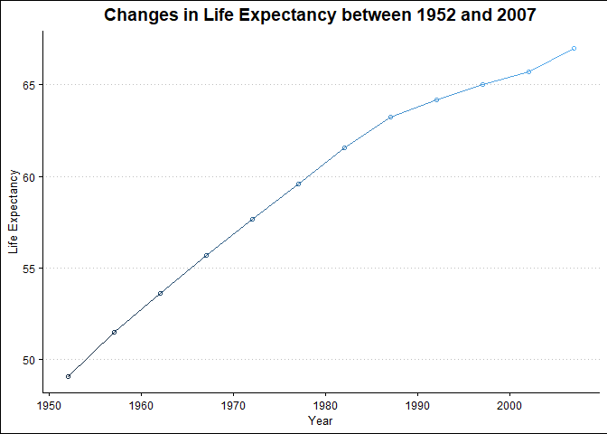
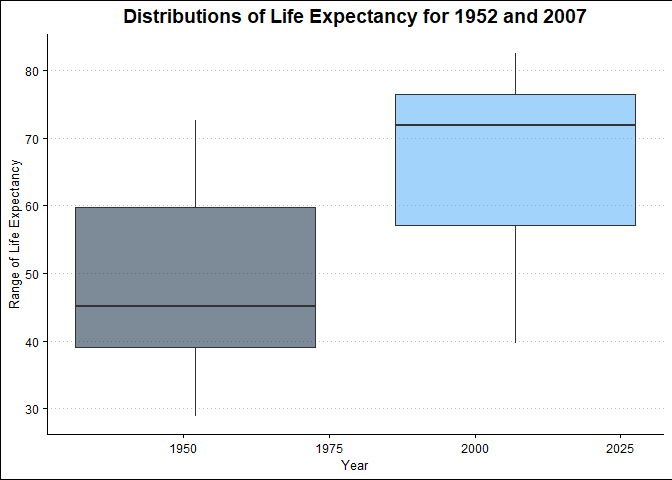
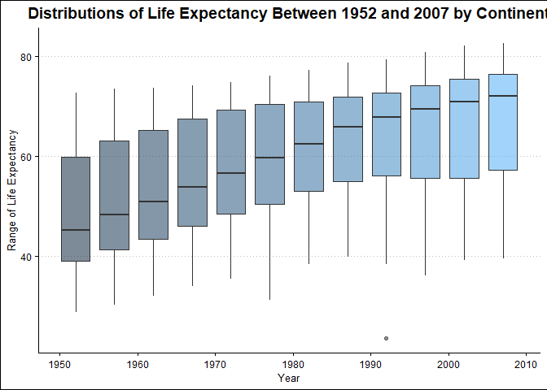
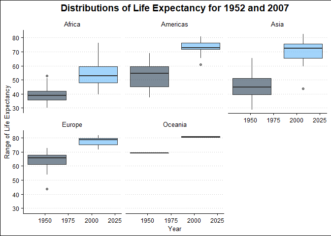
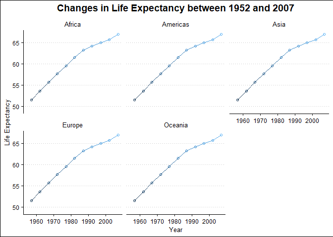
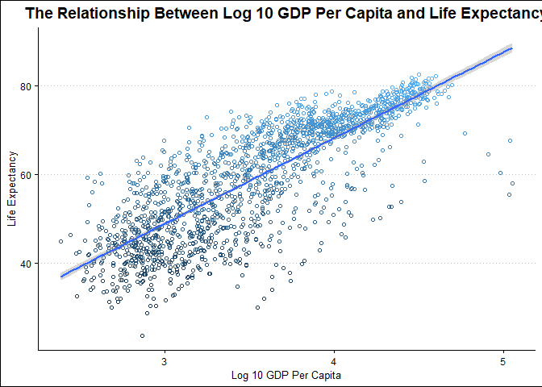
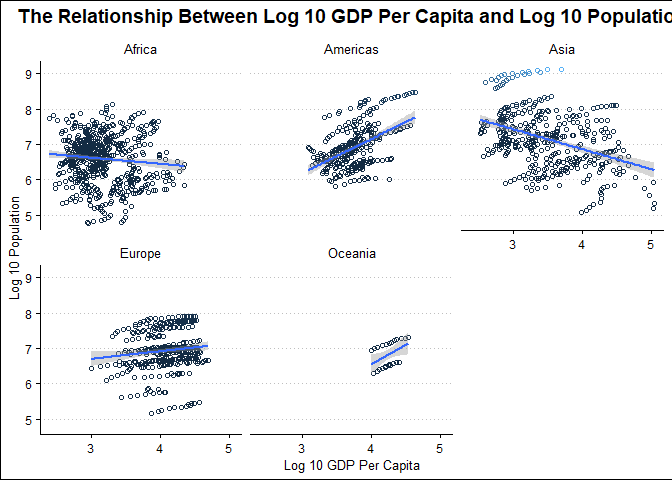

## Instructions
Answer the following questions and complete the exercises in RMarkdown. Please embed all of your code and push your final work to your repository. Your final lab report should be organized, clean, and run free from errors. Remember, you must remove the `#` for the included code chunks to run. Be sure to add your name to the author header above. For any included plots, make sure they are clearly labeled. You are free to use any plot type that you feel best communicates the results of your analysis.  

**In this homework, you should make use of the aesthetics you have learned. It's OK to be flashy!**

Make sure to use the formatting conventions of RMarkdown to make your report neat and clean!  

## Load the libraries

```r
library(tidyverse)
library(janitor)
library(here)
library(naniar)
library(ggthemes)
options(scipen=999)
ls("package:ggthemes")[grepl("theme_", ls("package:ggthemes"))]
```

```
##  [1] "theme_base"            "theme_calc"            "theme_clean"          
##  [4] "theme_economist"       "theme_economist_white" "theme_excel"          
##  [7] "theme_excel_new"       "theme_few"             "theme_fivethirtyeight"
## [10] "theme_foundation"      "theme_gdocs"           "theme_hc"             
## [13] "theme_igray"           "theme_map"             "theme_pander"         
## [16] "theme_par"             "theme_solarized"       "theme_solarized_2"    
## [19] "theme_solid"           "theme_stata"           "theme_tufte"          
## [22] "theme_wsj"
```

## Resources
The idea for this assignment came from [Rebecca Barter's](http://www.rebeccabarter.com/blog/2017-11-17-ggplot2_tutorial/) ggplot tutorial so if you get stuck this is a good place to have a look.  

## Gapminder
For this assignment, we are going to use the dataset [gapminder](https://cran.r-project.org/web/packages/gapminder/index.html). Gapminder includes information about economics, population, and life expectancy from countries all over the world. You will need to install it before use. This is the same data that we will use for midterm 2 so this is good practice.

```r
#install.packages("gapminder")
library("gapminder")
```

## Questions
The questions below are open-ended and have many possible solutions. Your approach should, where appropriate, include numerical summaries and visuals. Be creative; assume you are building an analysis that you would ultimately present to an audience of stakeholders. Feel free to try out different `geoms` if they more clearly present your results.  

**1. Use the function(s) of your choice to get an idea of the overall structure of the data frame, including its dimensions, column names, variable classes, etc. As part of this, determine how NA's are treated in the data.**  

It looks like there are no NA's present and that the data is already tidy for us.

```r
summary(gapminder)
```

```
##         country        continent        year         lifeExp     
##  Afghanistan:  12   Africa  :624   Min.   :1952   Min.   :23.60  
##  Albania    :  12   Americas:300   1st Qu.:1966   1st Qu.:48.20  
##  Algeria    :  12   Asia    :396   Median :1980   Median :60.71  
##  Angola     :  12   Europe  :360   Mean   :1980   Mean   :59.47  
##  Argentina  :  12   Oceania : 24   3rd Qu.:1993   3rd Qu.:70.85  
##  Australia  :  12                  Max.   :2007   Max.   :82.60  
##  (Other)    :1632                                                
##       pop               gdpPercap       
##  Min.   :     60011   Min.   :   241.2  
##  1st Qu.:   2793664   1st Qu.:  1202.1  
##  Median :   7023596   Median :  3531.8  
##  Mean   :  29601212   Mean   :  7215.3  
##  3rd Qu.:  19585222   3rd Qu.:  9325.5  
##  Max.   :1318683096   Max.   :113523.1  
## 
```

```r
gapminder <- gapminder
```

```r
gapminder_tidy <- janitor::clean_names(gapminder)
gapminder_tidy
```

```
## # A tibble: 1,704 x 6
##    country     continent  year life_exp      pop gdp_percap
##    <fct>       <fct>     <int>    <dbl>    <int>      <dbl>
##  1 Afghanistan Asia       1952     28.8  8425333       779.
##  2 Afghanistan Asia       1957     30.3  9240934       821.
##  3 Afghanistan Asia       1962     32.0 10267083       853.
##  4 Afghanistan Asia       1967     34.0 11537966       836.
##  5 Afghanistan Asia       1972     36.1 13079460       740.
##  6 Afghanistan Asia       1977     38.4 14880372       786.
##  7 Afghanistan Asia       1982     39.9 12881816       978.
##  8 Afghanistan Asia       1987     40.8 13867957       852.
##  9 Afghanistan Asia       1992     41.7 16317921       649.
## 10 Afghanistan Asia       1997     41.8 22227415       635.
## # ... with 1,694 more rows
```

**2. Among the interesting variables in gapminder is life expectancy. How has global life expectancy changed between 1952 and 2007?**


```r
colors <- paletteer::palettes_d_names
#view(colors)
#my_colors <- paletteer_d("colorBlindness::Blue2OrangeRed14Steps")
```


```r
#barplot(rep(1,14), axes = FALSE, col = my_colors)
```


```r
gapminder_tidy %>% 
  group_by(year) %>% 
  summarise(avg_life_exp=mean(life_exp))
```

```
## # A tibble: 12 x 2
##     year avg_life_exp
##  * <int>        <dbl>
##  1  1952         49.1
##  2  1957         51.5
##  3  1962         53.6
##  4  1967         55.7
##  5  1972         57.6
##  6  1977         59.6
##  7  1982         61.5
##  8  1987         63.2
##  9  1992         64.2
## 10  1997         65.0
## 11  2002         65.7
## 12  2007         67.0
```

```r
gapminder_tidyer <- gapminder_tidy %>%
  group_by(year) %>%
  mutate(avg_life_exp=mean(life_exp))
gapminder_tidyer
```

```
## # A tibble: 1,704 x 7
## # Groups:   year [12]
##    country     continent  year life_exp      pop gdp_percap avg_life_exp
##    <fct>       <fct>     <int>    <dbl>    <int>      <dbl>        <dbl>
##  1 Afghanistan Asia       1952     28.8  8425333       779.         49.1
##  2 Afghanistan Asia       1957     30.3  9240934       821.         51.5
##  3 Afghanistan Asia       1962     32.0 10267083       853.         53.6
##  4 Afghanistan Asia       1967     34.0 11537966       836.         55.7
##  5 Afghanistan Asia       1972     36.1 13079460       740.         57.6
##  6 Afghanistan Asia       1977     38.4 14880372       786.         59.6
##  7 Afghanistan Asia       1982     39.9 12881816       978.         61.5
##  8 Afghanistan Asia       1987     40.8 13867957       852.         63.2
##  9 Afghanistan Asia       1992     41.7 16317921       649.         64.2
## 10 Afghanistan Asia       1997     41.8 22227415       635.         65.0
## # ... with 1,694 more rows
```


```r
age_line <- gapminder_tidyer %>%
  group_by(year) %>%
  ggplot(aes(x=year, y=avg_life_exp, color=avg_life_exp))+
  geom_line()+
  geom_point(shape=1)+
  theme_clean()+
  #theme(legend.position = "bottom")
  labs(title="Changes in Life Expectancy between 1952 and 2007",
       x="Year",
       y="Life Expectancy")+
  theme(plot.title= element_text(hjust=0.5))+
  theme(legend.position ="none")+
  xlim(1952,2007)
age_line
```

<!-- -->

**3. How do the distributions of life expectancy compare for the years 1952 and 2007?**

```r
age_boxplot <- gapminder_tidyer %>%
  filter(year==1952 | year==2007) %>% 
  group_by(year) %>% 
  ggplot(aes(x=year, y=life_exp, group=year, fill=year, alpha=0.5))+
  geom_boxplot()+
  theme_clean()+
  #theme(legend.position = "bottom")
  labs(title="Distributions of Life Expectancy for 1952 and 2007",
       x="Year",
       y="Range of Life Expectancy")+
  theme(plot.title= element_text(hjust=0.5))+
  theme(legend.position ="none")
age_boxplot
```

<!-- -->

**4. Your answer above doesn't tell the whole story since life expectancy varies by region. Make a summary that shows the min, mean, and max life expectancy by continent for all years represented in the data.**

```r
gapminder_tidy %>% 
  group_by(year, continent) %>% 
  summarise(cont_life_exp=mean(life_exp))
```

```
## `summarise()` has grouped output by 'year'. You can override using the `.groups` argument.
```

```
## # A tibble: 60 x 3
## # Groups:   year [12]
##     year continent cont_life_exp
##    <int> <fct>             <dbl>
##  1  1952 Africa             39.1
##  2  1952 Americas           53.3
##  3  1952 Asia               46.3
##  4  1952 Europe             64.4
##  5  1952 Oceania            69.3
##  6  1957 Africa             41.3
##  7  1957 Americas           56.0
##  8  1957 Asia               49.3
##  9  1957 Europe             66.7
## 10  1957 Oceania            70.3
## # ... with 50 more rows
```


```r
gapminder_tidyer %>%
  group_by(year) %>% 
  ggplot(aes(x=year, y=life_exp, group=year, fill=year, alpha=0.5))+
  geom_boxplot()+
  theme_clean()+
  #theme(legend.position = "bottom")
  labs(title="Distributions of Life Expectancy Between 1952 and 2007 by Continent",
       x="Year",
       y="Range of Life Expectancy")+
  theme(plot.title= element_text(hjust=0.5))+
  theme(legend.position ="none")
```

<!-- -->

```r
age_boxplot+ facet_wrap(~continent)
```

<!-- -->

**5. How has life expectancy changed between 1952-2007 for each continent?**

```r
gapminder_tidyer %>%
  group_by(year, continent) %>%
  ggplot(aes(x=year, y=avg_life_exp, color=avg_life_exp))+
  geom_line()+
  geom_point(shape=1)+
  theme_clean()+
  labs(title="Changes in Life Expectancy between 1952 and 2007",
       x="Year",
       y="Life Expectancy")+
  theme(plot.title= element_text(hjust=0.5))+
  theme(legend.position ="none")+
  xlim(1955,2007)+
  facet_wrap(~continent)
```

```
## Warning: Removed 2 row(s) containing missing values (geom_path).
```

```
## Warning: Removed 142 rows containing missing values (geom_point).
```

<!-- -->

**6. We are interested in the relationship between per capita GDP and life expectancy; i.e. does having more money help you live longer?**


  

```r
gapminder_tidyer %>% 
  ggplot(aes(x=log10(gdp_percap), y=life_exp, color=life_exp))+
  geom_point(shape=1)+
  geom_smooth(method = lm)+
  labs(x="Log 10 GDP Per Capita",
       y="Life Expectancy",
       title="The Relationship Between Log 10 GDP Per Capita and Life Expectancy")+
  theme_clean()+
  theme(legend.position ="none")+
  theme(plot.title= element_text(hjust=0.5))
```

```
## `geom_smooth()` using formula 'y ~ x'
```

<!-- -->

<style>
div.blue { background-color:#e6f0ff; border-radius: 5px; padding: 20px;}
</style>
<div class = "blue">

**7. Which countries have had the largest population growth since 1952?**

```r
#gapminder_tidyer %>% 
#  filter(year==1952 | year ==2007) %>% 
#  pivot_wider(names_from = year, values_from=pop) %>% 
#  group_by(country) %>% 
#  summarise(
```
  

**8. Use your results from the question above to plot population growth for the top five countries since 1952.**

**9. How does per-capita GDP growth compare between these same five countries?**
</div>

**10. Make one plot of your choice that uses faceting!**

```r
gapminder_tidyer %>% 
  ggplot(aes(x=log10(gdp_percap), y=log10(pop), color=pop))+
  geom_point(shape=1)+
  geom_smooth(method=lm, se=T)+
  labs(title = "The Relationship Between Log 10 GDP Per Capita and Log 10 Population",
       x="Log 10 GDP Per Capita",
       y="Log 10 Population")+
  theme_clean()+
  theme(legend.position ="none")+
  theme(plot.title= element_text(hjust=0.5))+
  facet_wrap(~continent)
```

```
## `geom_smooth()` using formula 'y ~ x'
```

<!-- -->

## Push your final code to GitHub!
Please be sure that you check the `keep md` file in the knit preferences. 
