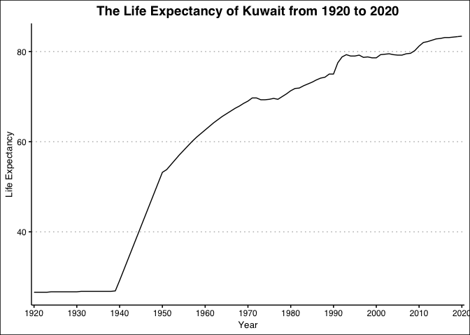
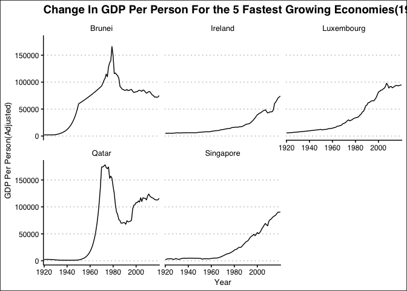
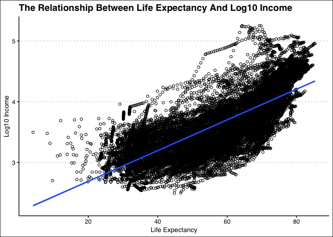

## Instructions
Answer the following questions and complete the exercises in RMarkdown. Please embed all of your code and push your final work to your repository. Your code should be organized, clean, and run free from errors. Be sure to **add your name** to the author header above. You may use any resources to answer these questions (including each other), but you may not post questions to Open Stacks or external help sites. There are 10 total questions.  

Make sure to use the formatting conventions of RMarkdown to make your report neat and clean! Your plots should use consistent aesthetics throughout. Feel free to be creative- there are many possible solutions to these questions!  

This exam is due by **12:00p on Tuesday, February 23**.  

## Load the libraries

```r
library(tidyverse)
```

```
## ── Attaching packages ─────────────────────────────────────── tidyverse 1.3.0 ──
```

```
## ✓ ggplot2 3.3.3     ✓ purrr   0.3.4
## ✓ tibble  3.1.0     ✓ dplyr   1.0.4
## ✓ tidyr   1.1.2     ✓ stringr 1.4.0
## ✓ readr   1.4.0     ✓ forcats 0.5.1
```

```
## ── Conflicts ────────────────────────────────────────── tidyverse_conflicts() ──
## x dplyr::filter() masks stats::filter()
## x dplyr::lag()    masks stats::lag()
```

```r
library(janitor)
```

```
## 
## Attaching package: 'janitor'
```

```
## The following objects are masked from 'package:stats':
## 
##     chisq.test, fisher.test
```

```r
library(here)
```

```
## here() starts at /Users/Joel/Desktop/BIS15W2021_GRAI
```

```r
library(ggthemes)
options(scipen=999) #disables scientific notation when printing
```

## Gapminder
For this assignment, we are going to use data from  [gapminder](https://www.gapminder.org/). Gapminder includes information about economics, population, social issues, and life expectancy from countries all over the world. We will use three data sets, so please load all three.  

One thing to note is that the data include years beyond 2021. These are projections based on modeling done by the gapminder organization. Start by importing the data.

```r
population <- readr::read_csv("data/population_total.csv")
```

```
## 
## ── Column specification ────────────────────────────────────────────────────────
## cols(
##   .default = col_double(),
##   country = col_character()
## )
## ℹ Use `spec()` for the full column specifications.
```

```r
population
```

```
## # A tibble: 195 x 302
##    country `1800` `1801` `1802` `1803` `1804` `1805` `1806` `1807` `1808` `1809`
##    <chr>    <dbl>  <dbl>  <dbl>  <dbl>  <dbl>  <dbl>  <dbl>  <dbl>  <dbl>  <dbl>
##  1 Afghan… 3.28e6 3.28e6 3.28e6 3.28e6 3.28e6 3.28e6 3.28e6 3.28e6 3.28e6 3.28e6
##  2 Albania 4.00e5 4.02e5 4.04e5 4.05e5 4.07e5 4.09e5 4.11e5 4.13e5 4.14e5 4.16e5
##  3 Algeria 2.50e6 2.51e6 2.52e6 2.53e6 2.54e6 2.55e6 2.56e6 2.56e6 2.57e6 2.58e6
##  4 Andorra 2.65e3 2.65e3 2.65e3 2.65e3 2.65e3 2.65e3 2.65e3 2.65e3 2.65e3 2.65e3
##  5 Angola  1.57e6 1.57e6 1.57e6 1.57e6 1.57e6 1.57e6 1.57e6 1.57e6 1.57e6 1.57e6
##  6 Antigu… 3.70e4 3.70e4 3.70e4 3.70e4 3.70e4 3.70e4 3.70e4 3.70e4 3.70e4 3.70e4
##  7 Argent… 5.34e5 5.20e5 5.06e5 4.92e5 4.79e5 4.66e5 4.53e5 4.41e5 4.29e5 4.17e5
##  8 Armenia 4.13e5 4.13e5 4.13e5 4.13e5 4.13e5 4.13e5 4.13e5 4.13e5 4.13e5 4.13e5
##  9 Austra… 2.00e5 2.05e5 2.11e5 2.16e5 2.22e5 2.27e5 2.33e5 2.39e5 2.46e5 2.52e5
## 10 Austria 3.00e6 3.02e6 3.04e6 3.05e6 3.07e6 3.09e6 3.11e6 3.12e6 3.14e6 3.16e6
## # … with 185 more rows, and 291 more variables: 1810 <dbl>, 1811 <dbl>,
## #   1812 <dbl>, 1813 <dbl>, 1814 <dbl>, 1815 <dbl>, 1816 <dbl>, 1817 <dbl>,
## #   1818 <dbl>, 1819 <dbl>, 1820 <dbl>, 1821 <dbl>, 1822 <dbl>, 1823 <dbl>,
## #   1824 <dbl>, 1825 <dbl>, 1826 <dbl>, 1827 <dbl>, 1828 <dbl>, 1829 <dbl>,
## #   1830 <dbl>, 1831 <dbl>, 1832 <dbl>, 1833 <dbl>, 1834 <dbl>, 1835 <dbl>,
## #   1836 <dbl>, 1837 <dbl>, 1838 <dbl>, 1839 <dbl>, 1840 <dbl>, 1841 <dbl>,
## #   1842 <dbl>, 1843 <dbl>, 1844 <dbl>, 1845 <dbl>, 1846 <dbl>, 1847 <dbl>,
## #   1848 <dbl>, 1849 <dbl>, 1850 <dbl>, 1851 <dbl>, 1852 <dbl>, 1853 <dbl>,
## #   1854 <dbl>, 1855 <dbl>, 1856 <dbl>, 1857 <dbl>, 1858 <dbl>, 1859 <dbl>,
## #   1860 <dbl>, 1861 <dbl>, 1862 <dbl>, 1863 <dbl>, 1864 <dbl>, 1865 <dbl>,
## #   1866 <dbl>, 1867 <dbl>, 1868 <dbl>, 1869 <dbl>, 1870 <dbl>, 1871 <dbl>,
## #   1872 <dbl>, 1873 <dbl>, 1874 <dbl>, 1875 <dbl>, 1876 <dbl>, 1877 <dbl>,
## #   1878 <dbl>, 1879 <dbl>, 1880 <dbl>, 1881 <dbl>, 1882 <dbl>, 1883 <dbl>,
## #   1884 <dbl>, 1885 <dbl>, 1886 <dbl>, 1887 <dbl>, 1888 <dbl>, 1889 <dbl>,
## #   1890 <dbl>, 1891 <dbl>, 1892 <dbl>, 1893 <dbl>, 1894 <dbl>, 1895 <dbl>,
## #   1896 <dbl>, 1897 <dbl>, 1898 <dbl>, 1899 <dbl>, 1900 <dbl>, 1901 <dbl>,
## #   1902 <dbl>, 1903 <dbl>, 1904 <dbl>, 1905 <dbl>, 1906 <dbl>, 1907 <dbl>,
## #   1908 <dbl>, 1909 <dbl>, …
```


```r
income <- readr::read_csv("data/income_per_person_gdppercapita_ppp_inflation_adjusted.csv")
```

```
## 
## ── Column specification ────────────────────────────────────────────────────────
## cols(
##   .default = col_double(),
##   country = col_character()
## )
## ℹ Use `spec()` for the full column specifications.
```

```r
income
```

```
## # A tibble: 193 x 242
##    country `1800` `1801` `1802` `1803` `1804` `1805` `1806` `1807` `1808` `1809`
##    <chr>    <dbl>  <dbl>  <dbl>  <dbl>  <dbl>  <dbl>  <dbl>  <dbl>  <dbl>  <dbl>
##  1 Afghan…    603    603    603    603    603    603    603    603    603    603
##  2 Albania    667    667    667    667    667    668    668    668    668    668
##  3 Algeria    715    716    717    718    719    720    721    722    723    724
##  4 Andorra   1200   1200   1200   1200   1210   1210   1210   1210   1220   1220
##  5 Angola     618    620    623    626    628    631    634    637    640    642
##  6 Antigu…    757    757    757    757    757    757    757    758    758    758
##  7 Argent…   1640   1640   1650   1650   1660   1660   1670   1680   1680   1690
##  8 Armenia    514    514    514    514    514    514    514    514    514    514
##  9 Austra…    817    822    826    831    836    841    845    850    855    860
## 10 Austria   1850   1850   1860   1870   1880   1880   1890   1900   1910   1920
## # … with 183 more rows, and 231 more variables: 1810 <dbl>, 1811 <dbl>,
## #   1812 <dbl>, 1813 <dbl>, 1814 <dbl>, 1815 <dbl>, 1816 <dbl>, 1817 <dbl>,
## #   1818 <dbl>, 1819 <dbl>, 1820 <dbl>, 1821 <dbl>, 1822 <dbl>, 1823 <dbl>,
## #   1824 <dbl>, 1825 <dbl>, 1826 <dbl>, 1827 <dbl>, 1828 <dbl>, 1829 <dbl>,
## #   1830 <dbl>, 1831 <dbl>, 1832 <dbl>, 1833 <dbl>, 1834 <dbl>, 1835 <dbl>,
## #   1836 <dbl>, 1837 <dbl>, 1838 <dbl>, 1839 <dbl>, 1840 <dbl>, 1841 <dbl>,
## #   1842 <dbl>, 1843 <dbl>, 1844 <dbl>, 1845 <dbl>, 1846 <dbl>, 1847 <dbl>,
## #   1848 <dbl>, 1849 <dbl>, 1850 <dbl>, 1851 <dbl>, 1852 <dbl>, 1853 <dbl>,
## #   1854 <dbl>, 1855 <dbl>, 1856 <dbl>, 1857 <dbl>, 1858 <dbl>, 1859 <dbl>,
## #   1860 <dbl>, 1861 <dbl>, 1862 <dbl>, 1863 <dbl>, 1864 <dbl>, 1865 <dbl>,
## #   1866 <dbl>, 1867 <dbl>, 1868 <dbl>, 1869 <dbl>, 1870 <dbl>, 1871 <dbl>,
## #   1872 <dbl>, 1873 <dbl>, 1874 <dbl>, 1875 <dbl>, 1876 <dbl>, 1877 <dbl>,
## #   1878 <dbl>, 1879 <dbl>, 1880 <dbl>, 1881 <dbl>, 1882 <dbl>, 1883 <dbl>,
## #   1884 <dbl>, 1885 <dbl>, 1886 <dbl>, 1887 <dbl>, 1888 <dbl>, 1889 <dbl>,
## #   1890 <dbl>, 1891 <dbl>, 1892 <dbl>, 1893 <dbl>, 1894 <dbl>, 1895 <dbl>,
## #   1896 <dbl>, 1897 <dbl>, 1898 <dbl>, 1899 <dbl>, 1900 <dbl>, 1901 <dbl>,
## #   1902 <dbl>, 1903 <dbl>, 1904 <dbl>, 1905 <dbl>, 1906 <dbl>, 1907 <dbl>,
## #   1908 <dbl>, 1909 <dbl>, …
```


```r
life_expectancy <- readr::read_csv("data/life_expectancy_years.csv")
```

```
## 
## ── Column specification ────────────────────────────────────────────────────────
## cols(
##   .default = col_double(),
##   country = col_character()
## )
## ℹ Use `spec()` for the full column specifications.
```

```r
life_expectancy
```

```
## # A tibble: 187 x 302
##    country `1800` `1801` `1802` `1803` `1804` `1805` `1806` `1807` `1808` `1809`
##    <chr>    <dbl>  <dbl>  <dbl>  <dbl>  <dbl>  <dbl>  <dbl>  <dbl>  <dbl>  <dbl>
##  1 Afghan…   28.2   28.2   28.2   28.2   28.2   28.2   28.1   28.1   28.1   28.1
##  2 Albania   35.4   35.4   35.4   35.4   35.4   35.4   35.4   35.4   35.4   35.4
##  3 Algeria   28.8   28.8   28.8   28.8   28.8   28.8   28.8   28.8   28.8   28.8
##  4 Andorra   NA     NA     NA     NA     NA     NA     NA     NA     NA     NA  
##  5 Angola    27     27     27     27     27     27     27     27     27     27  
##  6 Antigu…   33.5   33.5   33.5   33.5   33.5   33.5   33.5   33.5   33.5   33.5
##  7 Argent…   33.2   33.2   33.2   33.2   33.2   33.2   33.2   33.2   33.2   33.2
##  8 Armenia   34     34     34     34     34     34     34     34     34     34  
##  9 Austra…   34     34     34     34     34     34     34     34     34     34  
## 10 Austria   34.4   34.4   34.4   34.4   34.4   34.4   34.4   34.4   34.4   34.4
## # … with 177 more rows, and 291 more variables: 1810 <dbl>, 1811 <dbl>,
## #   1812 <dbl>, 1813 <dbl>, 1814 <dbl>, 1815 <dbl>, 1816 <dbl>, 1817 <dbl>,
## #   1818 <dbl>, 1819 <dbl>, 1820 <dbl>, 1821 <dbl>, 1822 <dbl>, 1823 <dbl>,
## #   1824 <dbl>, 1825 <dbl>, 1826 <dbl>, 1827 <dbl>, 1828 <dbl>, 1829 <dbl>,
## #   1830 <dbl>, 1831 <dbl>, 1832 <dbl>, 1833 <dbl>, 1834 <dbl>, 1835 <dbl>,
## #   1836 <dbl>, 1837 <dbl>, 1838 <dbl>, 1839 <dbl>, 1840 <dbl>, 1841 <dbl>,
## #   1842 <dbl>, 1843 <dbl>, 1844 <dbl>, 1845 <dbl>, 1846 <dbl>, 1847 <dbl>,
## #   1848 <dbl>, 1849 <dbl>, 1850 <dbl>, 1851 <dbl>, 1852 <dbl>, 1853 <dbl>,
## #   1854 <dbl>, 1855 <dbl>, 1856 <dbl>, 1857 <dbl>, 1858 <dbl>, 1859 <dbl>,
## #   1860 <dbl>, 1861 <dbl>, 1862 <dbl>, 1863 <dbl>, 1864 <dbl>, 1865 <dbl>,
## #   1866 <dbl>, 1867 <dbl>, 1868 <dbl>, 1869 <dbl>, 1870 <dbl>, 1871 <dbl>,
## #   1872 <dbl>, 1873 <dbl>, 1874 <dbl>, 1875 <dbl>, 1876 <dbl>, 1877 <dbl>,
## #   1878 <dbl>, 1879 <dbl>, 1880 <dbl>, 1881 <dbl>, 1882 <dbl>, 1883 <dbl>,
## #   1884 <dbl>, 1885 <dbl>, 1886 <dbl>, 1887 <dbl>, 1888 <dbl>, 1889 <dbl>,
## #   1890 <dbl>, 1891 <dbl>, 1892 <dbl>, 1893 <dbl>, 1894 <dbl>, 1895 <dbl>,
## #   1896 <dbl>, 1897 <dbl>, 1898 <dbl>, 1899 <dbl>, 1900 <dbl>, 1901 <dbl>,
## #   1902 <dbl>, 1903 <dbl>, 1904 <dbl>, 1905 <dbl>, 1906 <dbl>, 1907 <dbl>,
## #   1908 <dbl>, 1909 <dbl>, …
```

1. (3 points) Once you have an idea of the structure of the data, please make each data set tidy and store them as new objects. You will need both the original and tidy data!

```r
#summary(population)
population_long <-pivot_longer(population, -c(country), names_to = "year") %>% 
  rename(population="value")
#naniar::miss_var_summary(population_long)
```


```r
#summary(income)
income_long <-pivot_longer(income, -c(country), names_to = "year") %>% 
  rename(income="value")
#naniar::miss_var_summary(income_long)
```


```r
#summary(life_expectancy)
life_expectancy_long <-pivot_longer(life_expectancy, -c(country), names_to = "year", values_drop_na = T) %>% 
  rename(life_expectancy="value")
#naniar::miss_var_summary(life_expectancy_long)
```

2. (1 point) How many different countries are represented in the data? Provide the total number and their names. Since each data set includes different numbers of countries, you will need to do this for each one.

```r
population_long %>%
  tabyl(country)
```

```
##                         country   n     percent
##                     Afghanistan 301 0.005128205
##                         Albania 301 0.005128205
##                         Algeria 301 0.005128205
##                         Andorra 301 0.005128205
##                          Angola 301 0.005128205
##             Antigua and Barbuda 301 0.005128205
##                       Argentina 301 0.005128205
##                         Armenia 301 0.005128205
##                       Australia 301 0.005128205
##                         Austria 301 0.005128205
##                      Azerbaijan 301 0.005128205
##                         Bahamas 301 0.005128205
##                         Bahrain 301 0.005128205
##                      Bangladesh 301 0.005128205
##                        Barbados 301 0.005128205
##                         Belarus 301 0.005128205
##                         Belgium 301 0.005128205
##                          Belize 301 0.005128205
##                           Benin 301 0.005128205
##                          Bhutan 301 0.005128205
##                         Bolivia 301 0.005128205
##          Bosnia and Herzegovina 301 0.005128205
##                        Botswana 301 0.005128205
##                          Brazil 301 0.005128205
##                          Brunei 301 0.005128205
##                        Bulgaria 301 0.005128205
##                    Burkina Faso 301 0.005128205
##                         Burundi 301 0.005128205
##                        Cambodia 301 0.005128205
##                        Cameroon 301 0.005128205
##                          Canada 301 0.005128205
##                      Cape Verde 301 0.005128205
##        Central African Republic 301 0.005128205
##                            Chad 301 0.005128205
##                           Chile 301 0.005128205
##                           China 301 0.005128205
##                        Colombia 301 0.005128205
##                         Comoros 301 0.005128205
##                Congo, Dem. Rep. 301 0.005128205
##                     Congo, Rep. 301 0.005128205
##                      Costa Rica 301 0.005128205
##                   Cote d'Ivoire 301 0.005128205
##                         Croatia 301 0.005128205
##                            Cuba 301 0.005128205
##                          Cyprus 301 0.005128205
##                  Czech Republic 301 0.005128205
##                         Denmark 301 0.005128205
##                        Djibouti 301 0.005128205
##                        Dominica 301 0.005128205
##              Dominican Republic 301 0.005128205
##                         Ecuador 301 0.005128205
##                           Egypt 301 0.005128205
##                     El Salvador 301 0.005128205
##               Equatorial Guinea 301 0.005128205
##                         Eritrea 301 0.005128205
##                         Estonia 301 0.005128205
##                        Eswatini 301 0.005128205
##                        Ethiopia 301 0.005128205
##                            Fiji 301 0.005128205
##                         Finland 301 0.005128205
##                          France 301 0.005128205
##                           Gabon 301 0.005128205
##                          Gambia 301 0.005128205
##                         Georgia 301 0.005128205
##                         Germany 301 0.005128205
##                           Ghana 301 0.005128205
##                          Greece 301 0.005128205
##                         Grenada 301 0.005128205
##                       Guatemala 301 0.005128205
##                          Guinea 301 0.005128205
##                   Guinea-Bissau 301 0.005128205
##                          Guyana 301 0.005128205
##                           Haiti 301 0.005128205
##                        Holy See 301 0.005128205
##                        Honduras 301 0.005128205
##                         Hungary 301 0.005128205
##                         Iceland 301 0.005128205
##                           India 301 0.005128205
##                       Indonesia 301 0.005128205
##                            Iran 301 0.005128205
##                            Iraq 301 0.005128205
##                         Ireland 301 0.005128205
##                          Israel 301 0.005128205
##                           Italy 301 0.005128205
##                         Jamaica 301 0.005128205
##                           Japan 301 0.005128205
##                          Jordan 301 0.005128205
##                      Kazakhstan 301 0.005128205
##                           Kenya 301 0.005128205
##                        Kiribati 301 0.005128205
##                          Kuwait 301 0.005128205
##                 Kyrgyz Republic 301 0.005128205
##                             Lao 301 0.005128205
##                          Latvia 301 0.005128205
##                         Lebanon 301 0.005128205
##                         Lesotho 301 0.005128205
##                         Liberia 301 0.005128205
##                           Libya 301 0.005128205
##                   Liechtenstein 301 0.005128205
##                       Lithuania 301 0.005128205
##                      Luxembourg 301 0.005128205
##                      Madagascar 301 0.005128205
##                          Malawi 301 0.005128205
##                        Malaysia 301 0.005128205
##                        Maldives 301 0.005128205
##                            Mali 301 0.005128205
##                           Malta 301 0.005128205
##                Marshall Islands 301 0.005128205
##                      Mauritania 301 0.005128205
##                       Mauritius 301 0.005128205
##                          Mexico 301 0.005128205
##           Micronesia, Fed. Sts. 301 0.005128205
##                         Moldova 301 0.005128205
##                          Monaco 301 0.005128205
##                        Mongolia 301 0.005128205
##                      Montenegro 301 0.005128205
##                         Morocco 301 0.005128205
##                      Mozambique 301 0.005128205
##                         Myanmar 301 0.005128205
##                         Namibia 301 0.005128205
##                           Nauru 301 0.005128205
##                           Nepal 301 0.005128205
##                     Netherlands 301 0.005128205
##                     New Zealand 301 0.005128205
##                       Nicaragua 301 0.005128205
##                           Niger 301 0.005128205
##                         Nigeria 301 0.005128205
##                     North Korea 301 0.005128205
##                 North Macedonia 301 0.005128205
##                          Norway 301 0.005128205
##                            Oman 301 0.005128205
##                        Pakistan 301 0.005128205
##                           Palau 301 0.005128205
##                       Palestine 301 0.005128205
##                          Panama 301 0.005128205
##                Papua New Guinea 301 0.005128205
##                        Paraguay 301 0.005128205
##                            Peru 301 0.005128205
##                     Philippines 301 0.005128205
##                          Poland 301 0.005128205
##                        Portugal 301 0.005128205
##                           Qatar 301 0.005128205
##                         Romania 301 0.005128205
##                          Russia 301 0.005128205
##                          Rwanda 301 0.005128205
##                           Samoa 301 0.005128205
##                      San Marino 301 0.005128205
##           Sao Tome and Principe 301 0.005128205
##                    Saudi Arabia 301 0.005128205
##                         Senegal 301 0.005128205
##                          Serbia 301 0.005128205
##                      Seychelles 301 0.005128205
##                    Sierra Leone 301 0.005128205
##                       Singapore 301 0.005128205
##                 Slovak Republic 301 0.005128205
##                        Slovenia 301 0.005128205
##                 Solomon Islands 301 0.005128205
##                         Somalia 301 0.005128205
##                    South Africa 301 0.005128205
##                     South Korea 301 0.005128205
##                     South Sudan 301 0.005128205
##                           Spain 301 0.005128205
##                       Sri Lanka 301 0.005128205
##             St. Kitts and Nevis 301 0.005128205
##                       St. Lucia 301 0.005128205
##  St. Vincent and the Grenadines 301 0.005128205
##                           Sudan 301 0.005128205
##                        Suriname 301 0.005128205
##                          Sweden 301 0.005128205
##                     Switzerland 301 0.005128205
##                           Syria 301 0.005128205
##                      Tajikistan 301 0.005128205
##                        Tanzania 301 0.005128205
##                        Thailand 301 0.005128205
##                     Timor-Leste 301 0.005128205
##                            Togo 301 0.005128205
##                           Tonga 301 0.005128205
##             Trinidad and Tobago 301 0.005128205
##                         Tunisia 301 0.005128205
##                          Turkey 301 0.005128205
##                    Turkmenistan 301 0.005128205
##                          Tuvalu 301 0.005128205
##                          Uganda 301 0.005128205
##                         Ukraine 301 0.005128205
##            United Arab Emirates 301 0.005128205
##                  United Kingdom 301 0.005128205
##                   United States 301 0.005128205
##                         Uruguay 301 0.005128205
##                      Uzbekistan 301 0.005128205
##                         Vanuatu 301 0.005128205
##                       Venezuela 301 0.005128205
##                         Vietnam 301 0.005128205
##                           Yemen 301 0.005128205
##                          Zambia 301 0.005128205
##                        Zimbabwe 301 0.005128205
```

```r
population_long %>% 
  summarise(total_countries = n_distinct(country))
```

```
## # A tibble: 1 x 1
##   total_countries
##             <int>
## 1             195
```


```r
income_long %>%
  tabyl(country)
```

```
##                         country   n     percent
##                     Afghanistan 241 0.005181347
##                         Albania 241 0.005181347
##                         Algeria 241 0.005181347
##                         Andorra 241 0.005181347
##                          Angola 241 0.005181347
##             Antigua and Barbuda 241 0.005181347
##                       Argentina 241 0.005181347
##                         Armenia 241 0.005181347
##                       Australia 241 0.005181347
##                         Austria 241 0.005181347
##                      Azerbaijan 241 0.005181347
##                         Bahamas 241 0.005181347
##                         Bahrain 241 0.005181347
##                      Bangladesh 241 0.005181347
##                        Barbados 241 0.005181347
##                         Belarus 241 0.005181347
##                         Belgium 241 0.005181347
##                          Belize 241 0.005181347
##                           Benin 241 0.005181347
##                          Bhutan 241 0.005181347
##                         Bolivia 241 0.005181347
##          Bosnia and Herzegovina 241 0.005181347
##                        Botswana 241 0.005181347
##                          Brazil 241 0.005181347
##                          Brunei 241 0.005181347
##                        Bulgaria 241 0.005181347
##                    Burkina Faso 241 0.005181347
##                         Burundi 241 0.005181347
##                        Cambodia 241 0.005181347
##                        Cameroon 241 0.005181347
##                          Canada 241 0.005181347
##                      Cape Verde 241 0.005181347
##        Central African Republic 241 0.005181347
##                            Chad 241 0.005181347
##                           Chile 241 0.005181347
##                           China 241 0.005181347
##                        Colombia 241 0.005181347
##                         Comoros 241 0.005181347
##                Congo, Dem. Rep. 241 0.005181347
##                     Congo, Rep. 241 0.005181347
##                      Costa Rica 241 0.005181347
##                   Cote d'Ivoire 241 0.005181347
##                         Croatia 241 0.005181347
##                            Cuba 241 0.005181347
##                          Cyprus 241 0.005181347
##                  Czech Republic 241 0.005181347
##                         Denmark 241 0.005181347
##                        Djibouti 241 0.005181347
##                        Dominica 241 0.005181347
##              Dominican Republic 241 0.005181347
##                         Ecuador 241 0.005181347
##                           Egypt 241 0.005181347
##                     El Salvador 241 0.005181347
##               Equatorial Guinea 241 0.005181347
##                         Eritrea 241 0.005181347
##                         Estonia 241 0.005181347
##                        Eswatini 241 0.005181347
##                        Ethiopia 241 0.005181347
##                            Fiji 241 0.005181347
##                         Finland 241 0.005181347
##                          France 241 0.005181347
##                           Gabon 241 0.005181347
##                          Gambia 241 0.005181347
##                         Georgia 241 0.005181347
##                         Germany 241 0.005181347
##                           Ghana 241 0.005181347
##                          Greece 241 0.005181347
##                         Grenada 241 0.005181347
##                       Guatemala 241 0.005181347
##                          Guinea 241 0.005181347
##                   Guinea-Bissau 241 0.005181347
##                          Guyana 241 0.005181347
##                           Haiti 241 0.005181347
##                        Honduras 241 0.005181347
##                         Hungary 241 0.005181347
##                         Iceland 241 0.005181347
##                           India 241 0.005181347
##                       Indonesia 241 0.005181347
##                            Iran 241 0.005181347
##                            Iraq 241 0.005181347
##                         Ireland 241 0.005181347
##                          Israel 241 0.005181347
##                           Italy 241 0.005181347
##                         Jamaica 241 0.005181347
##                           Japan 241 0.005181347
##                          Jordan 241 0.005181347
##                      Kazakhstan 241 0.005181347
##                           Kenya 241 0.005181347
##                        Kiribati 241 0.005181347
##                          Kuwait 241 0.005181347
##                 Kyrgyz Republic 241 0.005181347
##                             Lao 241 0.005181347
##                          Latvia 241 0.005181347
##                         Lebanon 241 0.005181347
##                         Lesotho 241 0.005181347
##                         Liberia 241 0.005181347
##                           Libya 241 0.005181347
##                       Lithuania 241 0.005181347
##                      Luxembourg 241 0.005181347
##                      Madagascar 241 0.005181347
##                          Malawi 241 0.005181347
##                        Malaysia 241 0.005181347
##                        Maldives 241 0.005181347
##                            Mali 241 0.005181347
##                           Malta 241 0.005181347
##                Marshall Islands 241 0.005181347
##                      Mauritania 241 0.005181347
##                       Mauritius 241 0.005181347
##                          Mexico 241 0.005181347
##           Micronesia, Fed. Sts. 241 0.005181347
##                         Moldova 241 0.005181347
##                          Monaco 241 0.005181347
##                        Mongolia 241 0.005181347
##                      Montenegro 241 0.005181347
##                         Morocco 241 0.005181347
##                      Mozambique 241 0.005181347
##                         Myanmar 241 0.005181347
##                         Namibia 241 0.005181347
##                           Nauru 241 0.005181347
##                           Nepal 241 0.005181347
##                     Netherlands 241 0.005181347
##                     New Zealand 241 0.005181347
##                       Nicaragua 241 0.005181347
##                           Niger 241 0.005181347
##                         Nigeria 241 0.005181347
##                     North Korea 241 0.005181347
##                 North Macedonia 241 0.005181347
##                          Norway 241 0.005181347
##                            Oman 241 0.005181347
##                        Pakistan 241 0.005181347
##                           Palau 241 0.005181347
##                       Palestine 241 0.005181347
##                          Panama 241 0.005181347
##                Papua New Guinea 241 0.005181347
##                        Paraguay 241 0.005181347
##                            Peru 241 0.005181347
##                     Philippines 241 0.005181347
##                          Poland 241 0.005181347
##                        Portugal 241 0.005181347
##                           Qatar 241 0.005181347
##                         Romania 241 0.005181347
##                          Russia 241 0.005181347
##                          Rwanda 241 0.005181347
##                           Samoa 241 0.005181347
##                      San Marino 241 0.005181347
##           Sao Tome and Principe 241 0.005181347
##                    Saudi Arabia 241 0.005181347
##                         Senegal 241 0.005181347
##                          Serbia 241 0.005181347
##                      Seychelles 241 0.005181347
##                    Sierra Leone 241 0.005181347
##                       Singapore 241 0.005181347
##                 Slovak Republic 241 0.005181347
##                        Slovenia 241 0.005181347
##                 Solomon Islands 241 0.005181347
##                         Somalia 241 0.005181347
##                    South Africa 241 0.005181347
##                     South Korea 241 0.005181347
##                     South Sudan 241 0.005181347
##                           Spain 241 0.005181347
##                       Sri Lanka 241 0.005181347
##             St. Kitts and Nevis 241 0.005181347
##                       St. Lucia 241 0.005181347
##  St. Vincent and the Grenadines 241 0.005181347
##                           Sudan 241 0.005181347
##                        Suriname 241 0.005181347
##                          Sweden 241 0.005181347
##                     Switzerland 241 0.005181347
##                           Syria 241 0.005181347
##                      Tajikistan 241 0.005181347
##                        Tanzania 241 0.005181347
##                        Thailand 241 0.005181347
##                     Timor-Leste 241 0.005181347
##                            Togo 241 0.005181347
##                           Tonga 241 0.005181347
##             Trinidad and Tobago 241 0.005181347
##                         Tunisia 241 0.005181347
##                          Turkey 241 0.005181347
##                    Turkmenistan 241 0.005181347
##                          Tuvalu 241 0.005181347
##                          Uganda 241 0.005181347
##                         Ukraine 241 0.005181347
##            United Arab Emirates 241 0.005181347
##                  United Kingdom 241 0.005181347
##                   United States 241 0.005181347
##                         Uruguay 241 0.005181347
##                      Uzbekistan 241 0.005181347
##                         Vanuatu 241 0.005181347
##                       Venezuela 241 0.005181347
##                         Vietnam 241 0.005181347
##                           Yemen 241 0.005181347
##                          Zambia 241 0.005181347
##                        Zimbabwe 241 0.005181347
```

```r
income_long %>% 
  summarise(total_countries = n_distinct(country))
```

```
## # A tibble: 1 x 1
##   total_countries
##             <int>
## 1             193
```


```r
life_expectancy_long %>%
  tabyl(country)
```

```
##                         country   n      percent
##                     Afghanistan 301 0.0054206887
##                         Albania 301 0.0054206887
##                         Algeria 301 0.0054206887
##                         Andorra  48 0.0008644288
##                          Angola 301 0.0054206887
##             Antigua and Barbuda 301 0.0054206887
##                       Argentina 301 0.0054206887
##                         Armenia 301 0.0054206887
##                       Australia 301 0.0054206887
##                         Austria 301 0.0054206887
##                      Azerbaijan 301 0.0054206887
##                         Bahamas 301 0.0054206887
##                         Bahrain 301 0.0054206887
##                      Bangladesh 301 0.0054206887
##                        Barbados 301 0.0054206887
##                         Belarus 301 0.0054206887
##                         Belgium 301 0.0054206887
##                          Belize 301 0.0054206887
##                           Benin 301 0.0054206887
##                          Bhutan 301 0.0054206887
##                         Bolivia 301 0.0054206887
##          Bosnia and Herzegovina 301 0.0054206887
##                        Botswana 301 0.0054206887
##                          Brazil 301 0.0054206887
##                          Brunei 301 0.0054206887
##                        Bulgaria 301 0.0054206887
##                    Burkina Faso 301 0.0054206887
##                         Burundi 301 0.0054206887
##                        Cambodia 301 0.0054206887
##                        Cameroon 301 0.0054206887
##                          Canada 301 0.0054206887
##                      Cape Verde 301 0.0054206887
##        Central African Republic 301 0.0054206887
##                            Chad 301 0.0054206887
##                           Chile 301 0.0054206887
##                           China 301 0.0054206887
##                        Colombia 301 0.0054206887
##                         Comoros 301 0.0054206887
##                Congo, Dem. Rep. 301 0.0054206887
##                     Congo, Rep. 301 0.0054206887
##                      Costa Rica 301 0.0054206887
##                   Cote d'Ivoire 301 0.0054206887
##                         Croatia 301 0.0054206887
##                            Cuba 301 0.0054206887
##                          Cyprus 301 0.0054206887
##                  Czech Republic 301 0.0054206887
##                         Denmark 301 0.0054206887
##                        Djibouti 301 0.0054206887
##                        Dominica  48 0.0008644288
##              Dominican Republic 301 0.0054206887
##                         Ecuador 301 0.0054206887
##                           Egypt 301 0.0054206887
##                     El Salvador 301 0.0054206887
##               Equatorial Guinea 301 0.0054206887
##                         Eritrea 301 0.0054206887
##                         Estonia 301 0.0054206887
##                        Eswatini 301 0.0054206887
##                        Ethiopia 301 0.0054206887
##                            Fiji 301 0.0054206887
##                         Finland 301 0.0054206887
##                          France 301 0.0054206887
##                           Gabon 301 0.0054206887
##                          Gambia 301 0.0054206887
##                         Georgia 301 0.0054206887
##                         Germany 301 0.0054206887
##                           Ghana 301 0.0054206887
##                          Greece 301 0.0054206887
##                         Grenada 301 0.0054206887
##                       Guatemala 301 0.0054206887
##                          Guinea 301 0.0054206887
##                   Guinea-Bissau 301 0.0054206887
##                          Guyana 301 0.0054206887
##                           Haiti 301 0.0054206887
##                        Honduras 301 0.0054206887
##                         Hungary 301 0.0054206887
##                         Iceland 301 0.0054206887
##                           India 301 0.0054206887
##                       Indonesia 301 0.0054206887
##                            Iran 301 0.0054206887
##                            Iraq 301 0.0054206887
##                         Ireland 301 0.0054206887
##                          Israel 301 0.0054206887
##                           Italy 301 0.0054206887
##                         Jamaica 301 0.0054206887
##                           Japan 301 0.0054206887
##                          Jordan 301 0.0054206887
##                      Kazakhstan 301 0.0054206887
##                           Kenya 301 0.0054206887
##                        Kiribati 301 0.0054206887
##                          Kuwait 301 0.0054206887
##                 Kyrgyz Republic 301 0.0054206887
##                             Lao 301 0.0054206887
##                          Latvia 301 0.0054206887
##                         Lebanon 301 0.0054206887
##                         Lesotho 301 0.0054206887
##                         Liberia 301 0.0054206887
##                           Libya 301 0.0054206887
##                       Lithuania 301 0.0054206887
##                      Luxembourg 301 0.0054206887
##                      Madagascar 301 0.0054206887
##                          Malawi 301 0.0054206887
##                        Malaysia 301 0.0054206887
##                        Maldives 301 0.0054206887
##                            Mali 301 0.0054206887
##                           Malta 301 0.0054206887
##                Marshall Islands  48 0.0008644288
##                      Mauritania 301 0.0054206887
##                       Mauritius 301 0.0054206887
##                          Mexico 301 0.0054206887
##           Micronesia, Fed. Sts. 301 0.0054206887
##                         Moldova 301 0.0054206887
##                        Mongolia 301 0.0054206887
##                      Montenegro 301 0.0054206887
##                         Morocco 301 0.0054206887
##                      Mozambique 301 0.0054206887
##                         Myanmar 301 0.0054206887
##                         Namibia 301 0.0054206887
##                           Nepal 301 0.0054206887
##                     Netherlands 301 0.0054206887
##                     New Zealand 301 0.0054206887
##                       Nicaragua 301 0.0054206887
##                           Niger 301 0.0054206887
##                         Nigeria 301 0.0054206887
##                     North Korea 301 0.0054206887
##                 North Macedonia 301 0.0054206887
##                          Norway 301 0.0054206887
##                            Oman 301 0.0054206887
##                        Pakistan 301 0.0054206887
##                       Palestine 301 0.0054206887
##                          Panama 301 0.0054206887
##                Papua New Guinea 301 0.0054206887
##                        Paraguay 301 0.0054206887
##                            Peru 301 0.0054206887
##                     Philippines 301 0.0054206887
##                          Poland 301 0.0054206887
##                        Portugal 301 0.0054206887
##                           Qatar 301 0.0054206887
##                         Romania 301 0.0054206887
##                          Russia 301 0.0054206887
##                          Rwanda 301 0.0054206887
##                           Samoa 301 0.0054206887
##           Sao Tome and Principe 301 0.0054206887
##                    Saudi Arabia 301 0.0054206887
##                         Senegal 301 0.0054206887
##                          Serbia 301 0.0054206887
##                      Seychelles 301 0.0054206887
##                    Sierra Leone 301 0.0054206887
##                       Singapore 301 0.0054206887
##                 Slovak Republic 301 0.0054206887
##                        Slovenia 301 0.0054206887
##                 Solomon Islands 301 0.0054206887
##                         Somalia 301 0.0054206887
##                    South Africa 301 0.0054206887
##                     South Korea 301 0.0054206887
##                     South Sudan 301 0.0054206887
##                           Spain 301 0.0054206887
##                       Sri Lanka 301 0.0054206887
##                       St. Lucia 301 0.0054206887
##  St. Vincent and the Grenadines 301 0.0054206887
##                           Sudan 301 0.0054206887
##                        Suriname 301 0.0054206887
##                          Sweden 301 0.0054206887
##                     Switzerland 301 0.0054206887
##                           Syria 301 0.0054206887
##                      Tajikistan 301 0.0054206887
##                        Tanzania 301 0.0054206887
##                        Thailand 301 0.0054206887
##                     Timor-Leste 301 0.0054206887
##                            Togo 301 0.0054206887
##                           Tonga 301 0.0054206887
##             Trinidad and Tobago 301 0.0054206887
##                         Tunisia 301 0.0054206887
##                          Turkey 301 0.0054206887
##                    Turkmenistan 301 0.0054206887
##                          Uganda 301 0.0054206887
##                         Ukraine 301 0.0054206887
##            United Arab Emirates 301 0.0054206887
##                  United Kingdom 301 0.0054206887
##                   United States 301 0.0054206887
##                         Uruguay 301 0.0054206887
##                      Uzbekistan 301 0.0054206887
##                         Vanuatu 301 0.0054206887
##                       Venezuela 301 0.0054206887
##                         Vietnam 301 0.0054206887
##                           Yemen 301 0.0054206887
##                          Zambia 301 0.0054206887
##                        Zimbabwe 301 0.0054206887
```

```r
life_expectancy_long %>% 
  summarise(total_countries = n_distinct(country))
```

```
## # A tibble: 1 x 1
##   total_countries
##             <int>
## 1             187
```

## Life Expectancy  

3. (2 points) Let's limit the data to the past 100 years (1920-2020). For these years, which country has the highest life expectancy? How about the lowest life expectancy?  

Highest

```r
life_expectancy_long %>% 
  filter(year>=1920 | year <=2020) %>% 
  group_by(country) %>% 
  summarise(avg_life_expectancy=mean(life_expectancy)) %>% 
  arrange(desc(avg_life_expectancy))
```

```
## # A tibble: 187 x 2
##    country        avg_life_expectancy
##    <chr>                        <dbl>
##  1 Andorra                       79.8
##  2 Dominica                      73.0
##  3 Norway                        67.2
##  4 Sweden                        66.2
##  5 Denmark                       65.3
##  6 Switzerland                   64.7
##  7 Canada                        64.5
##  8 Netherlands                   64.5
##  9 United Kingdom                64.1
## 10 Iceland                       63.7
## # … with 177 more rows
```

Lowest

```r
life_expectancy_long %>% 
  filter(year>=1920 | year <=2020) %>% 
  group_by(country) %>% 
  summarise(avg_life_expectancy=mean(life_expectancy)) %>% 
  arrange((avg_life_expectancy))
```

```
## # A tibble: 187 x 2
##    country                  avg_life_expectancy
##    <chr>                                  <dbl>
##  1 Central African Republic                42.6
##  2 Yemen                                   43.6
##  3 Mali                                    43.8
##  4 Sierra Leone                            43.9
##  5 South Sudan                             44.1
##  6 Uganda                                  44.7
##  7 Kiribati                                44.8
##  8 Afghanistan                             45.1
##  9 Somalia                                 45.1
## 10 Vanuatu                                 45.3
## # … with 177 more rows
```

4. (3 points) Although we can see which country has the highest life expectancy for the past 100 years, we don't know which countries have changed the most. What are the top 5 countries that have experienced the biggest improvement in life expectancy between 1920-2020?

```r
life_expectancy_change <- life_expectancy_long %>% 
  filter(year>=1920 | year <=2020) %>% 
  pivot_wider(names_from = "year",
              names_prefix ="year_",
              values_from=life_expectancy) %>% 
  mutate(delta_life_exp=year_2020-year_1920)
```


```r
life_expectancy_change %>%
  select(country, delta_life_exp) %>% 
  arrange(desc(delta_life_exp)) %>% 
  top_n(delta_life_exp, n=5)
```

```
## # A tibble: 5 x 2
##   country         delta_life_exp
##   <chr>                    <dbl>
## 1 Kuwait                    56.8
## 2 Kyrgyz Republic           56.5
## 3 Turkmenistan              55.3
## 4 South Korea               55  
## 5 Tajikistan                54.3
```

<style>
div.blue { background-color:#e6f0ff; border-radius: 5px; padding: 20px;}
</style>
<div class = "blue">
5. (3 points) Make a plot that shows the change over the past 100 years for the country with the biggest improvement in life expectancy. Be sure to add appropriate aesthetics to make the plot clean and clear. Once you have made the plot, do a little internet searching and see if you can discover what historical event may have contributed to this remarkable change.  

```r
life_expectancy_long %>%
  filter(country=="Kuwait"& year>=1920 & year<=2020) %>%
  ggplot(aes(x=year,y=life_expectancy))+
  geom_line(group=1)+
  theme_clean()+
  labs(title="The Life Expectancy of Kuwait from 1920 to 2020",
       x="Year",
       y="Life Expectancy")+
  theme(plot.title = element_text(hjust=0.5))+
  scale_x_discrete(breaks=c(1920,1930, 1940,1950,1960,1970,1980,1990,2000,2010,2020))
```

<!-- -->
</div>

## Population Growth
6. (3 points) Which 5 countries have had the highest population growth over the past 100 years (1920-2020)?

```r
population_change <- population_long %>% 
  filter(year>=1920 | year <=2020) %>% 
  pivot_wider(names_from = "year",
              names_prefix ="year_",
              values_from=population) %>% 
  mutate(delta_population=year_2020-year_1920)
```


```r
population_change %>%
  select(country, delta_population) %>% 
  arrange(desc(delta_population)) %>% 
  top_n(delta_population, n=5)
```

```
## # A tibble: 5 x 2
##   country       delta_population
##   <chr>                    <dbl>
## 1 India               1063000000
## 2 China                968000000
## 3 Indonesia            226700000
## 4 United States        220000000
## 5 Pakistan             199300000
```

7. (4 points) Produce a plot that shows the 5 countries that have had the highest population growth over the past 100 years (1920-2020). Which countries appear to have had exponential growth?  

India and China appear to have grown exponentially.


```r
population_long %>% 
  filter(country=="India"| country=="China"| country=="Indonesia" |country=="United States" |country=="Pakistan") %>% 
  filter(year>=1920 & year <= 2020) %>% 
  ggplot(aes(x=year, y=population/1000000))+
  geom_line(group=1)+
  facet_wrap(~country)+
  scale_x_discrete(breaks=c(1920, 1940,1960,1980,2000,2000))+
  theme_clean()+
  labs(title = "Population Change For the 5 Fastest Growing Countries(1920-2020)",
       x="Year",
       y="Population(millions)")
```

<!-- -->

## Income
The units used for income are gross domestic product per person adjusted for differences in purchasing power in international dollars.

8. (4 points) As in the previous questions, which countries have experienced the biggest growth in per person GDP. Show this as a table and then plot the changes for the top 5 countries. With a bit of research, you should be able to explain the dramatic downturns of the wealthiest economies that occurred during the 1980's.

The downturn of the 1980's was cause the plunge in oil prices. We can assume that Brunei and Qatars economies or mostly resource(oil) based. 


```r
income_change <- income_long %>% 
  filter(year>=1920 | year <=2020) %>% 
  pivot_wider(names_from = "year",
              names_prefix ="year_",
              values_from=income) %>% 
  mutate(delta_income=year_2020-year_1920)
```

```r
income_change %>%
  select(country, delta_income) %>% 
  arrange(desc(delta_income)) %>% 
  top_n(delta_income, n=5)
```

```
## # A tibble: 5 x 2
##   country    delta_income
##   <chr>             <dbl>
## 1 Qatar            113700
## 2 Luxembourg        89370
## 3 Singapore         88060
## 4 Brunei            72970
## 5 Ireland           68930
```

```r
income_long %>% 
  filter(country=="Qatar"| country=="Luxembourg"| country=="Singapore" |country=="Brunei" |country=="Ireland") %>% 
  filter(year>=1920 & year <= 2020) %>% 
  ggplot(aes(x=year, y=income))+
  geom_line(group=1)+
  facet_wrap(~country)+
  scale_x_discrete(breaks=c(1920, 1940,1960,1980,2000,2000))+
  theme_clean()+
  labs(title = "Change In GDP Per Person For the 5 Fastest Growing Economies(1920-2020)",
       x="Year",
       y="GDP Per Person(Adjusted)")
```

<!-- -->

9. (3 points) Create three new objects that restrict each data set (life expectancy, population, income) to the years 1920-2020. Hint: I suggest doing this with the long form of your data. Once this is done, merge all three data sets using the code I provide below. You may need to adjust the code depending on how you have named your objects. I called mine `life_expectancy_100`, `population_100`, and `income_100`. For some of you, learning these `joins` will be important for your project.  

life_expectancy_100

```r
life_expectancy_100 <- life_expectancy_long %>% 
  filter(year>=1920 & year <=2020)
```

population_100

```r
population_100 <- population_long %>% 
  filter(year>=1920 & year <=2020)
```

income_100

```r
income_100 <- income_long %>% 
  filter(year>=1920 & year <=2020)
```


```r
gapminder_join <- inner_join(life_expectancy_100, population_100, by= c("country", "year"))
gapminder_join <- inner_join(gapminder_join, income_100, by= c("country", "year"))
gapminder_join
```

```
## # A tibble: 18,728 x 5
##    country     year  life_expectancy population income
##    <chr>       <chr>           <dbl>      <dbl>  <dbl>
##  1 Afghanistan 1920             30.6   10600000   1490
##  2 Afghanistan 1921             30.7   10500000   1520
##  3 Afghanistan 1922             30.8   10300000   1550
##  4 Afghanistan 1923             30.8    9710000   1570
##  5 Afghanistan 1924             30.9    9200000   1600
##  6 Afghanistan 1925             31      8720000   1630
##  7 Afghanistan 1926             31      8260000   1650
##  8 Afghanistan 1927             31.1    7830000   1680
##  9 Afghanistan 1928             31.1    7420000   1710
## 10 Afghanistan 1929             31.2    7100000   1740
## # … with 18,718 more rows
```

10. (4 points) Use the joined data to perform an analysis of your choice. The analysis should include a comparison between two or more of the variables `life_expectancy`, `population`, or `income.`

```r
gapminder_join %>% 
  ggplot(aes(x=life_expectancy, y=log10(income)))+
  geom_point(shape=1)+
  geom_smooth(method=lm)+
  labs(title="The Relationship Between Life Expectancy And Log10 Income",
       x="Life Expectancy",
       y="Log10 Income")+
  theme_clean()
```

```
## `geom_smooth()` using formula 'y ~ x'
```

<!-- -->

## Yikes, that's maybe a bit too much data. I wonder if it was just the means? Nicely done, I really like the faceting.
